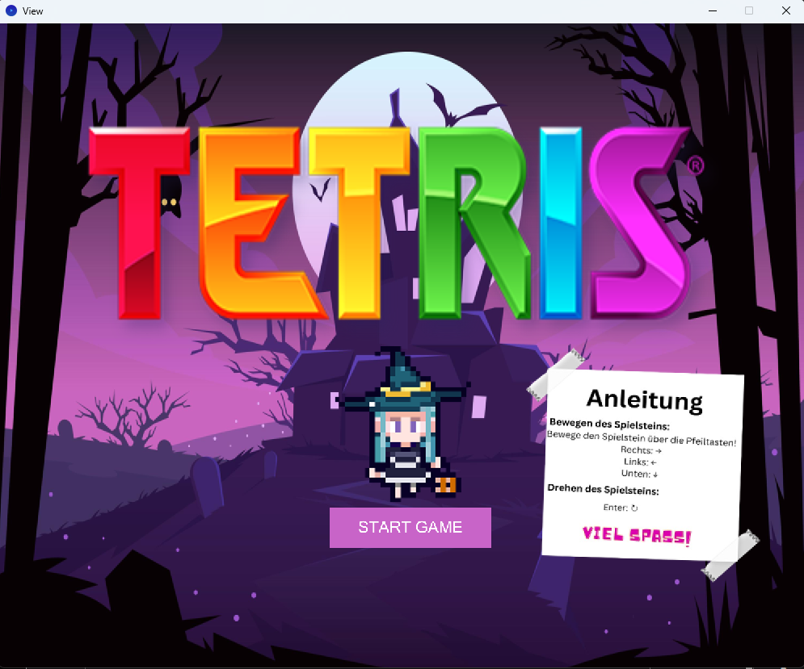
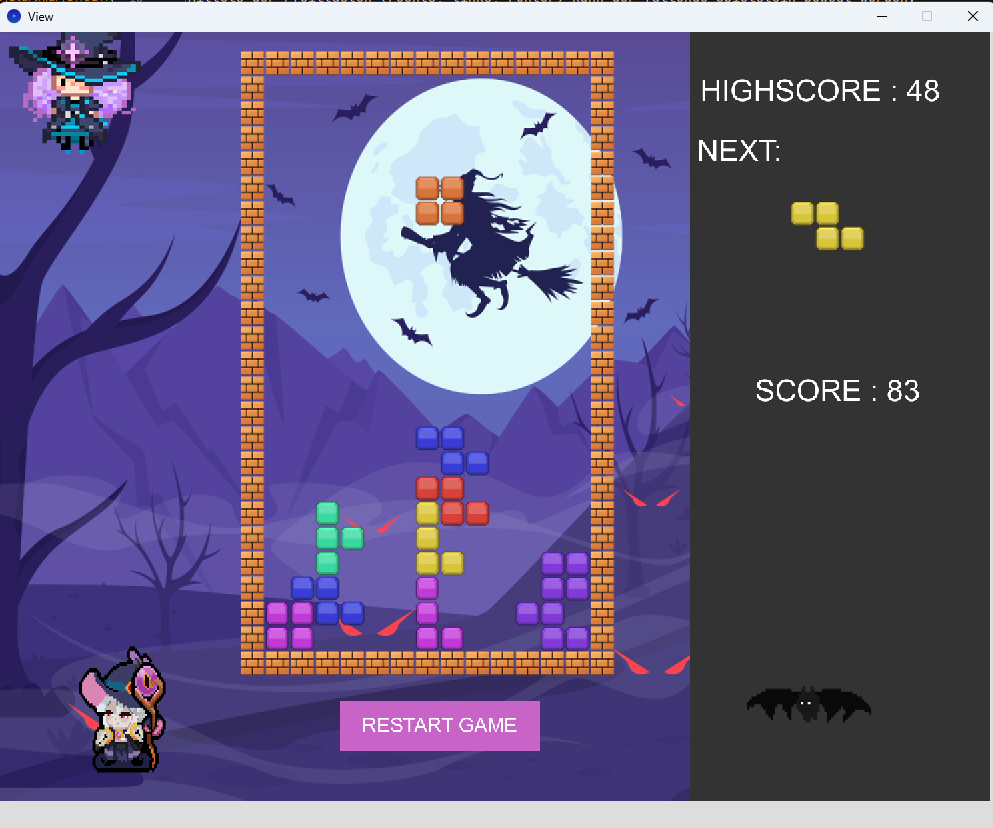
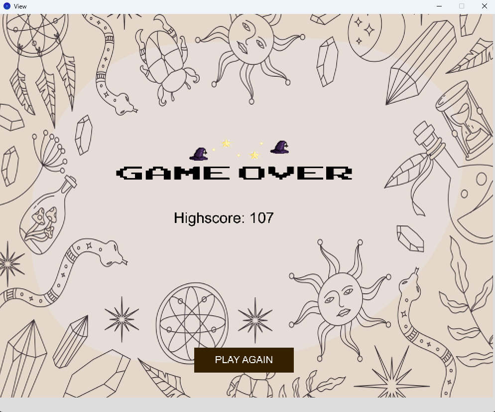

# Tetris-Spiel

Willkommen beim Tetris-Spiel! 🎮

In diesem Projekt dreht sich alles um die Implementierung des klassischen Tetris-Spiels.
Ziel des Spiels ist es, so viele Punkte wie möglich zu sammeln und den High Score zu übertreffen, indem man möglichst viele
Spielsteine im Spielfeld platziert. Je nach Schwierigkeitsgrad haben die Blöcke einen unterschiedlichen Punktewert: 
- O-Block= 2 Punkte
- I-Block= 3 Punkte
- T-Block= 5 Punkte
- Z-Block= 5 Punkte

Mittels der Pfeiltasten (rechts, links, runter) kann der fallende Spielstein bewegt werden. 
Durch gedrückt halten der Pfeiltaste nach unten, wird das Fallen des Spielsteines 
beschleunigt. Mit Drücken der Enter-Taste wird der Spielstein um 90 Grand im Uhrzeigersinn gedreht. 
Das Spiel kann jederzeit und nach Ende des Spiels mit Klicken des Buttons "Resart Game" erneut gestartet werden. 

## Verwendete Bibliotheken
Das Programm verwendet die folgenden Bibliotheken: 
- [Processing](http://www.processing.org)
- <a href= "https//jnuit.org"> JUNIT </a>
- [Java.util](https://docs.oracle.com/javase/8/docs/api/java/util/package-summary.html)
- [Controlp5](https://www.sojamo.de/libraries/controlP5/)
- [GIF] (https://github.com/akiljohnson1/GifAnimation)

## Screenshots
**Start Screen**

**Play Screen**

**End Screen** 

## Anwendung starten
Zum **Starten** der Anwendung müssen folgende Schritte befolgt werden:
1. Öffnen der Datei `Main().java` im src-Ordner
2. Starten der Funktion `main()`

## JShell Anleitung
Um Das Spiel in der JShell zu starten sind folgende Schritte notwendig:
1. Navigiere in der Kommandozeile in den Ordner ..\Tetris
2. dann öffne die jshell mit dem Keyword `jshell` und übergebe gleichzeitig den Klassenpfad in die Kommandozeile mit:
   `jshell --class-path "C:\Users\Startklar\OneDrive\Dokumente\Uni\THM 3. Semester\PIS\Projekt\Tetris\out\production\Tetris"`
3. Führe die `Import`-Anweisung in der jshell aus mit: `import Model.*`

## Erstellung eines Objekts
Mit dem `new`-Operator können aus der Klasse `Model` manuell ein neues Model-objekt erzeugt werden.
Es müssen keine Parameter als Werte übergeben werden. 

**Beispiel**
- `Model tetris=new Model()`

## Aufrufen einer Funktion
Mit dem Model können folgende Operationen zum Spielen ausgeführt werden.
- `start_new_Game()`
- `fall()`
- `move_left()`
- `move_right()`
- `turn()`

**Beispiele**
- `tetris.start_new_Game()`
- `tetris.fall();`

Viel Spaß! 😊